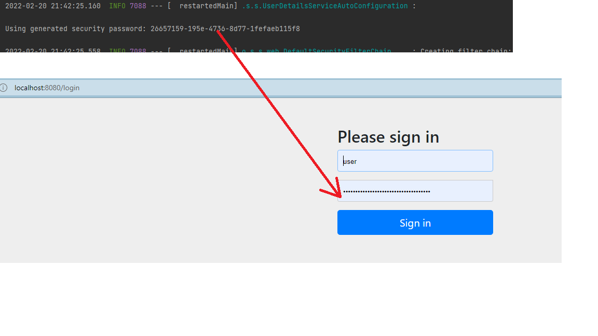

# 我的第一个SpringSecurity工程
- 正常情况的一个SpringBoot项目，启动直接可以通过浏览器访问到helloWorld


- 集成SpringSecurityApi,后启动项目

```xml
        <dependency>
            <groupId>org.springframework.boot</groupId>
            <artifactId>spring-boot-starter-security</artifactId>
        </dependency>
        <!-- 用于测试 -->
        <dependency>
            <groupId>org.springframework.security</groupId>
            <artifactId>spring-security-test</artifactId>
            <scope>test</scope>
        </dependency>
```

需要进行登录才能访问到helloWorld




